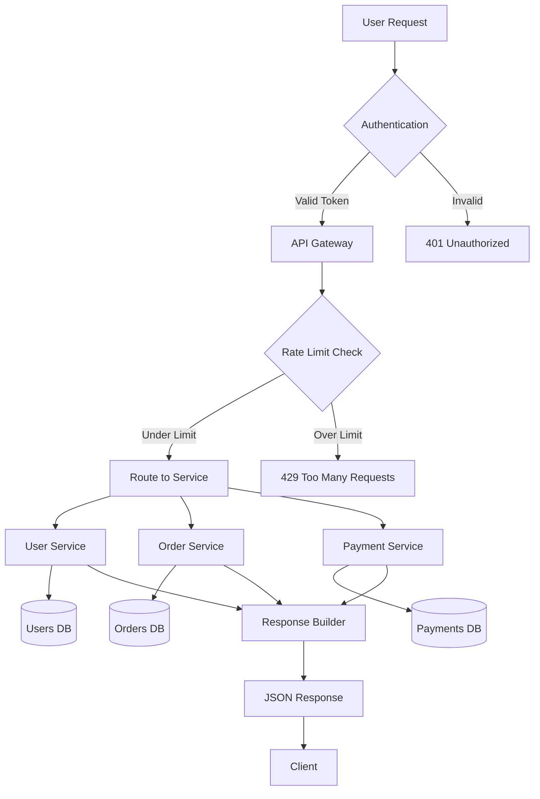
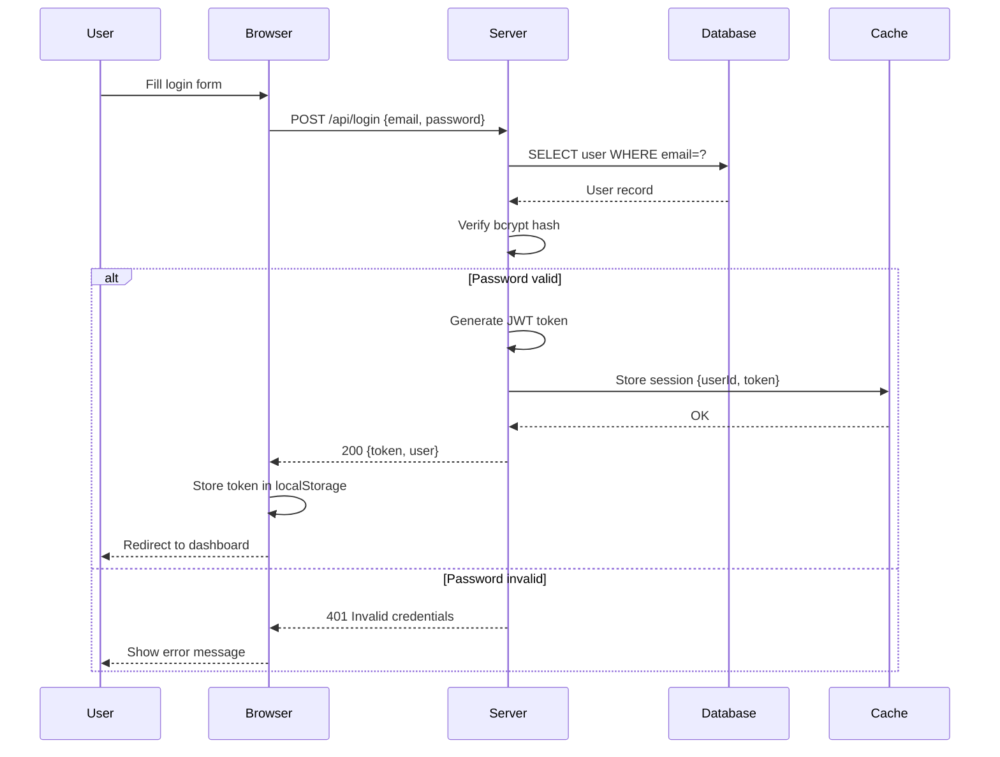

# Visual Explainer Skill

A Claude Code skill that converts any content into stunning visual explanations — whiteboard sketches, professional infographics, presentation slides, technical diagrams, mind maps, and UI wireframe mockups — powered by OpenAI's gpt-image-1.5 or Google Gemini's Nano Banana 2.

## About

AI-generated visual explanations have exploded in popularity — tools like NotebookLM and Gemini can turn documents into polished infographics and whiteboard sketches. But these tools are closed ecosystems. You can't customize the output style, integrate them into your dev workflow, or control the prompts that drive the generation.

**Visual Explainer** brings this capability directly into Claude Code as a slash command. It takes any content — a topic, a document, meeting notes, a codebase — and transforms it into a rich visual explanation using OpenAI's gpt-image-1.5 model.

The core insight is that image generation quality depends almost entirely on prompt quality. Visual Explainer uses deeply structured, 400-800 word prompts with explicit spatial layout, icon descriptions, color palettes, typography, and connections — producing results that rival or exceed what dedicated visual AI tools generate.

### Design Principles

- **Style Spectrum** — From rough whiteboard sketches to polished infographics, with a `--draw-level` parameter to control exactly where on the hand-drawn-to-professional spectrum the output lands
- **Deep Content Analysis** — Every generation starts with structured extraction of concepts, relationships, visual metaphors, and layout strategy before any prompt is written
- **Prompt Engineering as the Product** — The skill's value is in its style-specific prompt templates, not just API wrappers. Each style (whiteboard, infographic, presentation, diagram, mindmap, mindmap-structured, mockup) has a comprehensive template tuned for that visual language
- **Composable with Documents** — Works naturally with Claude Code's ability to read files, so you can point it at any existing doc, spec, or codebase and generate visuals from it

### Author

Created by [Eric Blue](https://about.ericblue.com) ([GitHub](https://github.com/ericblue))

## Example Gallery

### Whiteboard — How DNS Resolution Works

Hand-drawn, colorful, educator-style — like walking into a classroom with an amazing whiteboard illustration.


### Infographic — The Foundations of Machine Learning

Clean, structured, publication-quality — numbered sections, flat-design icons, cohesive color palettes.


### Whiteboard (Sketch) — How Git Branching Works

Rougher hand-drawn feel with `--draw-level sketch` — casual, playful, like a developer sketching during standup.


### Diagram — Kubernetes Pod Networking

Precise, technical, well-labeled architecture diagram with `--complexity detailed` — layered layout with color-coded legend.


### Multi-Frame — OAuth2 Authorization Code Flow

Progressive build-up with `--mode multi-frame` — 3 frames that introduce actors, show the flow, then present the complete picture.

<p>


</p>

### Presentation — Microservices Architecture

Bold, minimal, conference-keynote quality — dark background with strong visual hierarchy and layered architecture.


### Mind Map — Object-Oriented Programming

Vibrant, colorful, radial mind map — organic branches, bold colors, visual icons for each concept.


### Mind Map (Structured) — Project Management Methodologies

Clean, data-oriented, XMind-style — muted colors, category tags, metadata badges, professional layout.


### Mermaid → Infographic — API Request Lifecycle

Convert a Mermaid flowchart into a polished infographic with `--from mermaid`. All nodes, edges, and labels are extracted and transformed.


<details>
<summary>Source Mermaid</summary>


</details>

### Mermaid → Whiteboard — Login Authentication Flow

Convert a Mermaid sequence diagram into a vibrant whiteboard sketch with `--from mermaid`. Actors become illustrated characters, messages become hand-drawn arrows.


<details>
<summary>Source Mermaid</summary>


</details>

### Backend Comparison — How a CPU Executes an Instruction

Same topic, same style, same prompt — rendered by both backends for comparison.

| OpenAI (gpt-image-1.5) | Gemini (Nano Banana 2) |
|---|---|
|  |  |

| | OpenAI | Gemini |
|---|---|---|
| **Dimensions** | 1536x1024 (exact) | 1024x1024 (ignores size request) |
| **Text clarity** | Clean, all legible | Clean, all legible |
| **Style fidelity** | Polished whiteboard texture, subtle details | Bolder colors, stronger section borders |
| **Size control** | Honors exact dimensions | Always produces square output |
| **Cost** | ~$0.29/image | Free tier available |

Both backends produce quality results from the same prompt. OpenAI gives more control over dimensions and a more refined aesthetic. Gemini is solid and has a free tier but doesn't respect size parameters.

### Mockup — Admin Dashboard (Desktop)

Polished, Figma-quality UI wireframe with `--style mockup --device desktop` — browser chrome, sidebar navigation, stats cards, charts, and data table.


The mockup style supports three device frames (`--device mobile|desktop|tablet`) and three fidelity levels via `--draw-level`:
- **sketch** — hand-drawn wireframe, great for brainstorming and design sprints
- **normal** — mid-fidelity, clean enough to share with stakeholders
- **polished** — Figma/Sketch-quality, pixel-perfect precision for design reviews

Use cases: rapid wireframing from PRDs, brainstorming UI layouts, visualizing modernized interfaces for existing code, stakeholder alignment before opening Figma.

## Prerequisites

### GitHub Copilot / VS Code (PowerShell)

See the dedicated section **[GitHub Copilot / VS Code](#github-copilot--vs-code)** below for PowerShell-specific setup and installation.

### 1. Claude Code

Install Claude Code if you haven't already:

```bash
npm install -g @anthropic-ai/claude-code
```

### 2. Image Generation API Key

You need at least one of the following. If both are set, OpenAI is used by default (override with `--backend gemini`).

#### Option A: OpenAI (gpt-image-1.5)

1. Go to [platform.openai.com/api-keys](https://platform.openai.com/api-keys)
2. Create a new secret key and copy it

```bash
export OPENAI_API_KEY="sk-..."
```

#### Option B: Google Gemini (Nano Banana 2)

1. Go to [aistudio.google.com/apikey](https://aistudio.google.com/apikey)
2. Create an API key and copy it

```bash
export GEMINI_API_KEY="AIza..."
```

#### Persist across sessions

Add your key(s) to your shell profile:

```bash
# For zsh (~/.zshrc)
echo 'export OPENAI_API_KEY="sk-..."' >> ~/.zshrc
echo 'export GEMINI_API_KEY="AIza..."' >> ~/.zshrc
source ~/.zshrc

# For bash (~/.bashrc or ~/.bash_profile)
echo 'export OPENAI_API_KEY="sk-..."' >> ~/.bashrc
echo 'export GEMINI_API_KEY="AIza..."' >> ~/.bashrc
source ~/.bashrc
```

### 3. jq

The skill uses `jq` to parse JSON responses from the API:

```bash
# macOS
brew install jq

# Ubuntu/Debian
sudo apt-get install jq
```

## Compatibility

This skill was primarily developed and tested with **Claude Code**, but it should work with any Skills-compatible agent or CLI tool that supports markdown skill definitions, including:

- **[Claude Code](https://claude.ai/code)** (primary target)
- **[OpenClaw](https://github.com/ericblue/openclaw)** (tested)
- Any agent that reads `.md` skill files with YAML frontmatter

The skill is a self-contained markdown file with structured instructions. Any agent that can parse the frontmatter, read the step-by-step instructions, and execute shell commands (curl, jq, base64) can run it.

## Installation

### Claude Code

```bash
git clone <repo-url> && cd visual-explainer-skill
make install
```

Or manually:

```bash
cp skill/visual-explainer.md ~/.claude/commands/visual-explainer.md
```

The skill will be available immediately as `/visual-explainer` in any Claude Code session.

### OpenClaw

```bash
make openclaw-install
```

Or manually:

```bash
mkdir -p ~/clawd/skills/visual-explainer
cp skill/visual-explainer.md ~/clawd/skills/visual-explainer/SKILL.md
```

### Makefile targets

| Target | Description |
|--------|-------------|
| **Claude Code** | |
| `make install` | Install to `~/.claude/commands/` |
| `make uninstall` | Remove from `~/.claude/commands/` |
| **OpenClaw** | |
| `make openclaw-install` | Install to `~/clawd/skills/` |
| `make openclaw-uninstall` | Remove from `~/clawd/skills/` |
| `make openclaw-check` | Check install status |
| **General** | |
| `make info` | Show skill name, version, author, and available styles |
| `make version` | Print the current version |
| `make check` | Verify prerequisites (jq, skill files, OPENAI_API_KEY) |

## Usage

```
/visual-explainer [--style S] [--draw-level L] [--complexity C] [--size WxH] [--mode M] [--output DIR] [--prefix NAME] <content>
```

### Quick examples

```bash
# Default whiteboard style
/visual-explainer How DNS resolution works

# Professional infographic
/visual-explainer --style infographic The foundations of machine learning

# Rough sketch feel
/visual-explainer --draw-level sketch How Git branching works

# Detailed technical diagram
/visual-explainer --style diagram --complexity detailed Kubernetes pod networking

# Multi-frame progressive build-up
/visual-explainer --mode multi-frame The OAuth2 authorization code flow

# Custom output location
/visual-explainer --output ./docs/images --prefix arch-overview System architecture of a microservices app

# Colorful radial mind map
/visual-explainer --style mindmap The principles of object-oriented programming

# Clean, data-oriented XMind-style mind map
/visual-explainer --style mindmap-structured Project management methodologies

# UI wireframe mockup (mobile, polished by default)
/visual-explainer --style mockup A mobile app login screen with email, password, social login, and forgot password

# Desktop web app wireframe
/visual-explainer --style mockup --device desktop An admin dashboard with sidebar nav, stats cards, charts, and data table

# Hand-drawn wireframe for brainstorming
/visual-explainer --style mockup --draw-level sketch A settings page with profile photo, name fields, toggles, and save button

# Use Gemini instead of OpenAI
/visual-explainer --backend gemini How the water cycle works
```

### Converting Mermaid diagrams

Any Mermaid diagram can be transformed into any visual style. The skill parses nodes, edges, subgraphs, and labels to build a detailed visual prompt.

```bash
# Inline Mermaid — paste or type the diagram as the content
/visual-explainer --style infographic --from mermaid flowchart TD; A[Start] --> B{Decision}; B -->|Yes| C[Do Thing]; B -->|No| D[Other Thing]

# From a .mmd file
/visual-explainer --style whiteboard --from mermaid-file docs/architecture.mmd

# From a markdown file containing a mermaid code block
/visual-explainer --style presentation --from mermaid-file docs/sequence-diagram.md

# Auto-detect — if the content looks like Mermaid, it's parsed automatically
/visual-explainer --style diagram sequenceDiagram; participant A as Client; participant B as Server; A->>B: Request; B-->>A: Response
```

### Working with existing documents

The skill works great when pointed at existing files. You can ask it to read a document, summarize the key concepts, and generate a visual from it.

**Generate directly from a file:**

```
Read docs/architecture.md and then /visual-explainer --style diagram the system architecture described in that document
```

**Summarize first, then visualize:**

```
Read docs/api-spec.md, summarize the key endpoints, request/response flows, and auth
mechanisms, then /visual-explainer --style infographic the summary
```

**Visualize a README or spec:**

```
Review the PRD at docs/product-requirements.md and /visual-explainer --style presentation
a one-slide executive summary of the product vision, key features, and target users
```

**Turn meeting notes into a whiteboard:**

```
Read notes/2024-03-15-retro.md and /visual-explainer --draw-level sketch
a whiteboard summary of the key takeaways, action items, and themes
```

**Compare concepts from a doc:**

```
Read docs/database-comparison.md and /visual-explainer --style infographic --complexity detailed
a comparison of the database options with pros, cons, and recommendations
```

**Multi-frame walkthrough of a complex doc:**

```
Read docs/deployment-guide.md and /visual-explainer --mode multi-frame --style whiteboard
the deployment process as a step-by-step walkthrough
```

**Visualize code architecture:**

```
Review the src/ directory structure and key modules, then /visual-explainer --style diagram
--complexity detailed the codebase architecture showing module dependencies and data flow
```

### Options

| Option | Values | Default | Description |
|--------|--------|---------|-------------|
| `--style` | `whiteboard`, `infographic`, `presentation`, `diagram`, `mindmap`, `mindmap-structured`, `mockup` | `whiteboard` | Visual style |
| `--device` | `mobile`, `desktop`, `tablet` | `mobile` | Device frame for mockup style |
| `--draw-level` | `sketch`, `normal`, `polished` | `normal` | Hand-drawn roughness vs clean precision |
| `--complexity` | `simple`, `moderate`, `detailed` | `moderate` | Number of concepts (3-4, 5-7, or 8-12) |
| `--size` | `1024x1024`, `1536x1024`, `1024x1536` | Style-dependent | Image dimensions |
| `--mode` | `single`, `multi-frame` | `single` | One image or a progressive series |
| `--from` | `mermaid`, `mermaid-file PATH` | (none) | Parse Mermaid input (inline or from a file) |
| `--backend` | `openai`, `gemini` | Auto-detected | Image generation backend. Auto-detects based on available API keys. |
| `--output` | Directory path | `./` | Where to save generated images |
| `--prefix` | String | `visual-explainer` | Filename prefix |

### Default sizes by style

| Style | Default Size | Orientation |
|-------|-------------|-------------|
| Whiteboard | 1536x1024 | Landscape |
| Infographic | 1024x1536 | Portrait |
| Presentation | 1536x1024 | Landscape |
| Diagram | 1024x1024 | Square |
| Mind Map | 1536x1024 | Landscape |
| Mind Map (Structured) | 1536x1024 | Landscape |
| Mockup (mobile/tablet) | 1024x1536 | Portrait |
| Mockup (desktop) | 1536x1024 | Landscape |

## How It Works

1. **Backend detection** — Auto-detects available API keys (OpenAI or Gemini) and reports which backend will be used
2. **Content analysis** — The skill deeply analyzes your input to extract core concepts, sub-topics, relationships, visual metaphors, and an optimal layout strategy
3. **Prompt construction** — A detailed 400-800 word prompt is built using style-specific templates that specify exact spatial positions, icons, colors, typography, connections, and decorative elements
4. **Image generation** — The prompt is sent to OpenAI gpt-image-1.5 or Gemini Nano Banana 2
5. **Structured output** — A text summary of sections, relationships, and backend used is provided alongside the image

## Cost

### OpenAI (gpt-image-1.5)

| Size | Estimated Cost |
|------|---------------|
| 1024x1024 | ~$0.19 |
| 1536x1024 / 1024x1536 | ~$0.29 |

### Gemini (Nano Banana 2)

Free tier available. Check current pricing at [aistudio.google.com](https://aistudio.google.com/).

Multi-frame mode generates multiple images (3-5), so costs multiply accordingly.

## Tips

- **Text-heavy content** works best with `infographic` style
- **Process/flow content** works best with `diagram` style
- **Engaging/fun explanations** work best with `whiteboard` style
- **Hierarchical/categorical content** works best with `mindmap` (colorful) or `mindmap-structured` (data-oriented)
- Use `mindmap` when the audience values visual appeal and creativity
- Use `mindmap-structured` for board presentations, strategy docs, or data-heavy taxonomies
- **UI wireframes and screen layouts** work best with `mockup` style — use `--device` to match the target platform
- Use `mockup --draw-level sketch` for early brainstorming, `--draw-level polished` for stakeholder-ready wireframes
- Use `--draw-level sketch` for a casual, brainstormy feel
- Use `--draw-level polished` for clean hand-lettering on whiteboard style
- Use `--complexity detailed` when you need comprehensive coverage
- If results feel too sparse, try increasing complexity; if too cluttered, decrease it

## Version History

| Version | Date | Description |
|---------|------|-------------|
| 1.3.0 | 2026-04-02 | Mockup/wireframe style with device frames |
| 1.2.0 | 2026-04-02 | Gemini/Nano Banana 2 backend support |
| 1.1.0 | 2026-04-01 | Mermaid diagram conversion support |
| 1.0.0 | 2026-04-01 | Initial release |

### v1.3.0 — Mockup/Wireframe Style

- New `mockup` style for generating UI wireframes and screen mockups
- `--device` flag to select device frame: `mobile` (phone), `desktop` (browser window), `tablet` (iPad-style)
- Three fidelity levels via `--draw-level`: sketch (hand-drawn), normal (mid-fi), polished (Figma-quality)
- Comprehensive prompt template with support for navigation, input fields, buttons, cards, tables, charts, and all standard UI components
- Annotation support for wireframe callouts and specifications
- Ideal for rapid wireframing from PRDs, brainstorming UI layouts, and visualizing modernized interfaces

### v1.2.0 — Gemini Backend Support

- `--backend` flag to choose between `openai` (gpt-image-1.5) and `gemini` (Nano Banana 2)
- Auto-detection: uses whichever API key is available; defaults to OpenAI if both are set
- Backend reported before generation and in structured output summary
- Gemini API integration via `generativelanguage.googleapis.com`
- Size handling adapted for Gemini (dimensions included in prompt text)
- Updated prerequisites to support either `OPENAI_API_KEY` or `GEMINI_API_KEY`

### v1.1.0 — Mermaid Diagram Conversion

- `--from mermaid` flag for inline Mermaid input
- `--from mermaid-file PATH` for reading `.mmd` or `.md` files
- Auto-detection of Mermaid syntax in content
- Full parsing of all Mermaid diagram types: flowchart, sequence, class, state, ER, gantt, pie, mindmap, timeline
- Extracts nodes, edges, subgraphs, participants, attributes, and labels for precise prompt construction
- Any Mermaid diagram type can be rendered in any visual style

### v1.0.0 — Initial Release

- 6 visual styles at launch: whiteboard, infographic, presentation, diagram, mindmap, mindmap-structured
- `--draw-level` parameter (sketch, normal, polished) for hand-drawn vs professional spectrum
- `--complexity` parameter (simple, moderate, detailed) for content density control
- `--mode multi-frame` for progressive build-up explanations
- Deep content analysis pipeline with concept extraction, visual metaphors, and layout strategy
- Style-specific prompt templates (400-800 words) for each visual style
- Integration with OpenAI gpt-image-1.5 via generate-images skill
- YAML frontmatter with official Claude Code skill metadata
- Makefile with install, uninstall, version management, and release targets
- 8 example images across all styles

## License

MIT — see [LICENSE](LICENSE) for details.

---

## GitHub Copilot / VS Code

> **Fork of [ericblue/visual-explainer-skill](https://github.com/ericblue/visual-explainer-skill)** by [Eric Blue](https://eric-blue.com).
> This fork is a port for **GitHub Copilot (VS Code)** using **PowerShell 5.1+** instead of bash + curl + jq.
> The original skill, style templates, and examples are Eric Blue's work — this repository adapts the execution layer for Windows and VS Code.

This section covers installation and usage of the skill in **GitHub Copilot (VS Code)** with **PowerShell 5.1+**, via the `@keber/visual-explainer-skill` npm package.

### Differences from the original skill

| Aspect | Original (Claude Code) | This fork (VS Code) |
|--------|------------------------|----------------------|
| Runtime | bash + curl + jq | PowerShell 5.1+ |
| Install | `make install` | `npm install -g @keber/visual-explainer-skill` |
| Discovery | `~/.claude/commands/` | `.github/skills/visual-explainer/` |
| Multi-frame | ✅ supported | ⏳ out of MVP |
| `--from mermaid` | ✅ supported | ⏳ out of MVP |
| `--style mockup` | ✅ supported | ⏳ out of MVP |
| Backends | OpenAI, Gemini | OpenAI gpt-image-1.5, Gemini gemini-2.0-flash-preview-image-generation |

### Requirements

- **PowerShell 5.1+** (included in Windows 10/11; PS 7+ recommended for better performance)
- **Node.js 16+** (for the install CLI)
- **OPENAI_API_KEY** or **GEMINI_API_KEY** set as an environment variable

### Installation

```powershell
# 1. Install the CLI globally
npm install -g @keber/visual-explainer-skill

# 2. In your project directory (where you want to use the skill)
cd my-project
visual-explainer install --skills

# 3. Verify the skill was installed
Test-Path .github\skills\visual-explainer\SKILL.md
```

GitHub Copilot and Claude Code discover the skill automatically from `.github/skills/`.

### Configuring API keys (PowerShell)

```powershell
# Set for the current session
$env:OPENAI_API_KEY = 'sk-...'    # from https://platform.openai.com/api-keys
# or
$env:GEMINI_API_KEY = 'AIza...'   # from https://aistudio.google.com/apikey

# Persist in your PowerShell profile (equivalent to ~/.bashrc)
Add-Content $PROFILE "`n`$env:OPENAI_API_KEY = 'sk-...'"
# or
Add-Content $PROFILE "`n`$env:GEMINI_API_KEY = 'AIza...'"
```

### Usage from GitHub Copilot (VS Code)

Once installed, use the skill normally:

```
/visual-explainer How DNS resolution works
/visual-explainer --style infographic How machine learning models are trained
/visual-explainer --style diagram --complexity detailed Kubernetes pod networking
/visual-explainer --style mindmap The principles of object-oriented programming
/visual-explainer --backend gemini How the water cycle works
```

The agent analyzes the content, builds a detailed prompt, and calls the PowerShell script:

```powershell
& '.github/skills/visual-explainer/scripts/visual-explainer.ps1' `
    -PromptFile "$env:TEMP\ve-prompt-<timestamp>.txt" `
    -Style      infographic `
    -Size       1024x1536 `
    -Output     './' `
    -Prefix     'visual' `
    -Backend    auto
```

### Manual verification (testing the script directly)

```powershell
# Create a test prompt file
$promptFile = "$env:TEMP\ve-test.txt"
Set-Content -Path $promptFile -Value "Create a simple infographic about the TLS handshake process" -Encoding UTF8

# Run the script
& '.github\skills\visual-explainer\scripts\visual-explainer.ps1' `
    -PromptFile $promptFile `
    -Style      infographic `
    -Output     "." `
    -Prefix     "test"

# Verify the PNG was generated
Test-Path .\test-1.png
```

### Additional Makefile targets

| Target | Description |
|--------|-------------|
| `make install-skills` | Install the skill to `.github/skills/` in the current directory |
| `make npm-pack` | Pack the npm module (`@keber/visual-explainer-skill`) |

